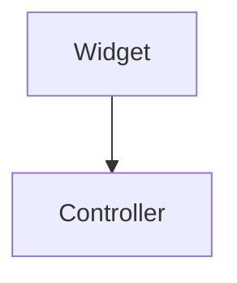

# Contributing

Thanks for considering a contribution. This handbook gets better mainly through
corrections and lived experience, so small, specific pull requests are the most useful
kind.

## Ways to contribute

- **Fix something wrong.** An outdated API, a broken link, a recommendation that no
  longer holds. Open a PR directly — no issue needed.
- **Fill in a draft page.** Pages marked *Draft* are stubs waiting for content.
- **Add a tradeoff.** If a section presents one option as universally correct, that is a
  bug. Add the case where it fails.
- **Contribute numbers.** Measured results (frame times, build sizes, cold-start
  numbers) with the setup described beat any amount of assertion.

## Development setup

```bash
git clone https://github.com/ma-mamun/flutter-engineering-handbook.git
cd flutter-engineering-handbook

python -m venv .venv && source .venv/bin/activate
pip install -r requirements.txt

mkdocs serve      # live-reloading preview at http://127.0.0.1:8000
```

Before pushing:

```bash
mkdocs build --strict     # fails on broken links and bad references
dart format --output=none --set-exit-if-changed code examples   # if you touched Dart
dart analyze code examples
```

CI runs exactly these checks.

## Writing style

The handbook has a voice. Keeping it consistent matters more than any individual
preference, so:

- **Lead with the recommendation, then justify it.** The reader should know what to do
  by the end of the first paragraph.
- **Always name the tradeoff.** Every technique costs something. Say what.
- **Prefer runnable code.** Snippets live under `code/` and are embedded into pages with
  the `--8<--` snippet syntax, so they get formatted and analyzed by CI rather than
  rotting in a Markdown fence.
- **Second person, present tense.** "You wrap the widget in…", not "One would wrap…".
- **No hype.** Skip "blazing fast", "game changer", and "simply". If it were simple the
  page would not need to exist.
- **One sentence per line** in Markdown source where practical — it keeps diffs readable.

### Embedding code

Put the snippet in `code/<section>/<name>.dart`, then reference it from the page:

````markdown
```dart
;--8<-- "state_management/counter_controller.dart"
```
````

(Drop the leading `;` — it is only there to stop this page from expanding the example.)

Paths are relative to `code/`, configured via `pymdownx.snippets` in `mkdocs.yml`.

### Diagrams

Diagrams are Mermaid, written inline in the page or kept in `diagrams/` when reused.
Fence them as `mermaid` — the theme renders them natively, no image export needed.

````markdown

````

## Pull request process

1. Branch from `main`: `git checkout -b docs/testing-goldens`.
2. Keep the PR focused. One topic per PR reviews far faster than five.
3. Write a [Conventional Commits](https://www.conventionalcommits.org/) message:

   ```
   docs(testing): add golden test setup guide

   Covers golden_toolkit configuration, font loading, and the CI
   font-rendering difference that causes false failures on Linux.
   ```

   Common types here: `docs`, `code`, `chore`, `ci`, `fix`.
4. Fill in the PR template — mainly, say what changed and how you verified it.
5. A maintainer reviews. Expect questions about tradeoffs; they are not objections.

## Reporting problems

Use the issue templates:

- **Correction** — something in the handbook is wrong or outdated.
- **Content request** — a topic that should be covered but is not.

For anything sensitive, email the address in [CODE_OF_CONDUCT.md](https://github.com/ma-mamun/flutter-engineering-handbook/blob/main/CODE_OF_CONDUCT.md)
instead of opening a public issue.

## Licensing of contributions

By contributing you agree that your contributions — documentation and code alike — are
licensed under the [MIT License](https://github.com/ma-mamun/flutter-engineering-handbook/blob/main/LICENSE), the same terms covering the rest of the
project.
