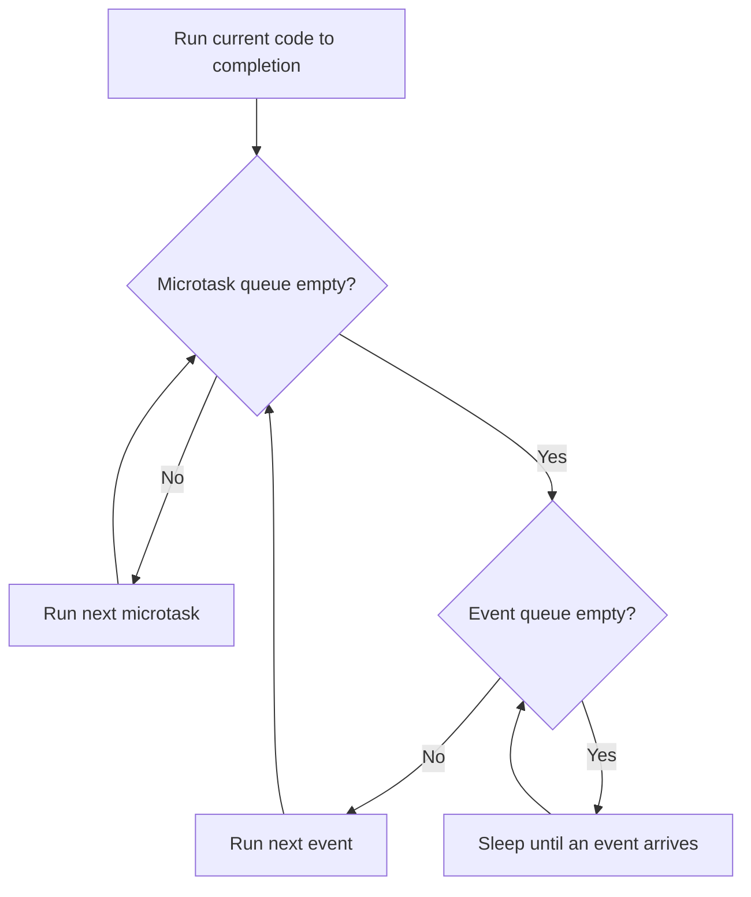

# Async and concurrency

What actually happens when you `await`: the event loop, the two queues it drains, and why
`Future(...)` and `Future.microtask(...)` do not run in the order most people expect.

## The recommendation

Learn the two queues before learning the operators. Almost every async bug in a Flutter app
is one of four things: work that never left the UI isolate, an ordering assumption that
holds in debug and breaks under load, an error thrown across an `await` that nobody
catches, or a subscription nobody cancelled. All four are explained by the model below.

## One isolate, one thread, two queues

A Dart isolate has a single thread, its own heap, and an event loop. The loop does exactly
this, forever:



Two rules follow, and between them they explain every ordering question you will be asked:

1. **Synchronous code runs to completion.** Nothing interrupts it — no timer, no I/O
   callback, no frame. This is why you never need a lock around synchronous Dart.
2. **The microtask queue is drained completely before a single event is taken.** And after
   each event, the microtask queue is drained again.

What goes where:

| Goes on the microtask queue | Goes on the event queue |
| --- | --- |
| `scheduleMicrotask(f)` | `Timer(...)`, `Timer.periodic` |
| `Future.microtask(f)` | `Future(...)` and `Future.delayed(...)` |
| The continuation after an `await` | I/O completion, socket and file callbacks |
| `future.then(f)` on an already-completed future | Platform channel messages from native |
|  | Gesture and pointer events, and the next frame |

The trap is the second row: **`Future(() {...})` is an event, not a microtask.** It is a
zero-duration timer. `Future.microtask(() {...})` is a microtask. The names suggest they
are variations of one thing; the scheduling says otherwise.

### The ordering, asserted rather than claimed

This sample is compiled and its ordering is asserted by a test in the repository, so it
cannot drift from the runtime's actual behaviour:

```dart
--8<-- "dart/event_loop.dart"
```

The order `eventLoopOrder` produces:

```text
1 sync
2 sync
3 scheduleMicrotask
4 Future.microtask
5 after await null
6 Future(...)
7 Timer.run
```

Read the two interesting lines. `await null` suspends the function and queues the rest of
the body as a **microtask** — so it lands behind microtasks queued earlier, but still ahead
of every timer. And `Future(...)`, created before the `Timer.run` and before the `await`,
runs last but one, because it was never a microtask at all.

### Microtask starvation

Because the loop drains microtasks completely, a microtask that schedules another microtask
never gives the event queue a turn:

```dart
void spin() => scheduleMicrotask(spin); // the app stops rendering, forever
```

The UI freezes while the CPU stays busy and the isolate is technically "not blocked".
Timers stop firing, I/O callbacks stop arriving, and in Flutter the next frame never gets
scheduled — because the frame callback is an event.

**The practical rule:** use `scheduleMicrotask` when ordering *within the current turn*
matters — usually to guarantee something happens before the next frame. Use `Future(...)`
or `Timer.run` to yield to the event loop and let the UI breathe. When in doubt, prefer the
event queue.

## Future

A `Future` is a single value that arrives later, and it has exactly three states: pending,
completed with a value, completed with an error. It is not lazy — the work starts when the
future is created, not when you await it — and it is not cancellable.

```dart
// Both requests are already in flight here.
final userFuture = api.fetchUser(id);
final feedFuture = api.fetchFeed(id);

// This awaits both in parallel: total time is the slower one, not the sum.
final [user, feed] = await Future.wait([userFuture, feedFuture]);

// This is sequential, and a common accidental slowdown.
final user2 = await api.fetchUser(id);
final feed2 = await api.fetchFeed(id);
```

Useful constructors and combinators, and when each earns its place:

| API | Use for |
| --- | --- |
| `Future.value(x)` | A synchronous value in an async signature |
| `Future.error(e)` | A failure in an async signature, without throwing synchronously |
| `Future.delayed(d)` | Backoff, and nothing else — never for "wait for state to settle" |
| `Future.wait([...])` | Parallel work where you need all results |
| `Future.any([...])` | Racing a request against a timeout or a second source |
| `future.timeout(d)` | A deadline; throws `TimeoutException` unless `onTimeout` is given |
| `Completer<T>` | Bridging a callback API into a future |

`Future.wait` fails fast: if one future errors, the returned future errors, and the others
keep running with nobody listening. If their errors then go unhandled you get a crash with
a confusing stack. Pass `eagerError: false` (the default) and handle each, or wrap each in
`Result.guard` so failure is a value rather than a throw.

### How async/await works internally

`async` is a compiler transform, not a thread. The compiler rewrites the function into a
state machine:

- The function body is split at every `await` into resumable segments.
- Calling the function runs synchronously up to the **first** `await`, then returns a
  future immediately. This is why an `async` function that validates its arguments before
  the first `await` throws synchronously — and why validation belongs there.
- At each `await`, the remaining segments are registered as a callback on the awaited
  future and the function returns control to the event loop.
- When the future completes, that continuation is scheduled as a **microtask**.

Consequences worth knowing:

```dart
Future<void> save() async {
  if (id.isEmpty) throw ArgumentError('id');  // throws synchronously — caller must
  await db.write(id);                          // be in a try, not just an onError
}
```

```dart
// `await` inside a loop is sequential. On 100 items with a 50 ms call each, that is
// five seconds.
for (final id in ids) {
  await api.fetch(id);
}

// Concurrent, but now you have 100 sockets open at once.
await Future.wait(ids.map(api.fetch));

// Usually right: bounded concurrency.
for (final chunk in ids.slices(8)) {
  await Future.wait(chunk.map(api.fetch));
}
```

## Stream

A `Stream` is zero or more values over time, plus an optional error and a done event. Use
one when values keep arriving; use a `Future` when there is exactly one answer.

| | Future | Stream |
| --- | --- | --- |
| Values | Exactly one, or an error | Zero to many, then done |
| Starts when | Created | Listened to (single-subscription) |
| Cancellable | No | Yes, via the subscription |
| Awaits with | `await` | `await for`, or `listen` |
| Flutter widget | `FutureBuilder` | `StreamBuilder` |
| Typical source | HTTP call, one DB read | Sockets, sensors, DB watches, user input |

### Single-subscription vs broadcast

This is the distinction that produces "Bad state: Stream has already been listened to".

- **Single-subscription** (the default) allows exactly one listener ever. Events are
  buffered until someone listens, and nothing is lost. Use for a finite sequence with one
  consumer: a file being read, one request's response.
- **Broadcast** allows any number of listeners, delivers only to those listening *at the
  time* an event fires, and buffers nothing. Use for shared app state and events.

```dart
final controller = StreamController<int>();            // single-subscription
final events = StreamController<int>.broadcast();      // many listeners

// Turning one into the other for a screen that needs two builders:
final shared = source.asBroadcastStream();
```

!!! warning "A broadcast stream drops events with no listener"
    A widget that subscribes in `initState` misses everything emitted before it mounted.
    If a late subscriber must see the current value, expose the value as state — a
    `ValueNotifier`, a `BehaviorSubject`, or a Riverpod provider — rather than expecting a
    broadcast stream to replay it.

### StreamController, and the four callbacks that matter

```dart
final controller = StreamController<Position>(
  onListen: () => _gps.start(),      // start work when someone cares
  onPause: () => _gps.pause(),       // a paused listener must stop the source, or
  onResume: () => _gps.resume(),     // events pile up in memory
  onCancel: () => _gps.stop(),       // release everything — this is your dispose
);
```

Wiring `onListen`/`onCancel` is what turns a controller into a resource that cleans up
after itself. Without them, the sensor, socket or database watch keeps running after the
last listener leaves.

Two hard rules:

- **Close every controller**, in `dispose`. An unclosed controller keeps its listeners, and
  its listeners keep their closures, and those closures keep your `State`.
- **Cancel every subscription** you create, in `dispose`. `StreamSubscription.cancel()`
  returns a `Future`; awaiting it matters only when the cancel triggers async teardown.

```dart
StreamSubscription<Position>? _subscription;

@override
void initState() {
  super.initState();
  _subscription = positions.listen(_onPosition);
}

@override
void dispose() {
  _subscription?.cancel(); // without this, _onPosition runs after the widget is gone
  super.dispose();
}
```

### Transformations worth writing yourself

`debounce` and `switchMap` are the two operators people install rxdart to get. Both are
`StreamController` plumbing, and writing them once teaches you exactly what a subscription
owns:

```dart
--8<-- "dart/stream_pipeline.dart"
```

Two details in that file are the actual lesson:

- **`switchMap` cancels the previous inner stream.** `asyncExpand` does not — it waits for
  the in-flight request to finish first, so a slow response for `"fl"` can land after and
  overwrite the results for `"flutter"`. Search-as-you-type needs `switchMap`.
- **Never cancel a subscription from inside its own `onDone`.** A subscription cancelled
  that way never delivers its done event, and the downstream listener hangs open forever.
  Drop the handle first, then close.

### Debounce and throttle

Same problem — "this fires too often" — with different failure modes:

```dart
--8<-- "dart/debounce_throttle.dart"
```

**Debounce** waits for quiet, so it is right for a search field and wrong for a scroll
handler that must react while the user is still scrolling. **Throttle** runs immediately
then ignores calls for a window, so it is right for scroll and resize and wrong for search,
where it fires on a half-typed query.

Both hold a `Timer`, which means both need a `dispose`. A debouncer that fires after its
widget is gone calls `setState` on a dead `State`, and that crash reproduces only when the
user navigates back quickly.

## Error handling

Errors travel with the future or stream, not up the call stack, so a `try` in the wrong
place catches nothing.

```dart
// Catches nothing: the future is returned before it fails.
try {
  return api.fetch();          // no await
} on Exception {
  return fallback;
}

// Catches it: `await` re-throws the error into this frame.
try {
  return await api.fetch();
} on Exception {
  return fallback;
}
```

`return await` inside a `try` is not redundant — it is the difference between catching the
error and not. Outside a `try`, it is redundant and the linter will say so.

Streams carry errors as events, and by default an error terminates the subscription:

```dart
subscription = stream.listen(
  onData,
  onError: (Object error, StackTrace stack) => _report(error, stack),
  cancelOnError: false, // keep listening after a recoverable error
);
```

Three more things worth knowing:

- **`unawaited(...)`** documents that you deliberately did not await a future. It also
  keeps the `unawaited_futures` lint useful, which is what catches the accidental case.
- **An unhandled error in a fire-and-forget future** surfaces asynchronously, with a stack
  that points nowhere useful. Always attach a `catchError` or wrap in a guard.
- **`runZonedGuarded`** catches errors that escape everything else. It belongs in `main`,
  reporting to your crash tool, and nowhere else — see
  [error handling](../part-02-professional/error-handling.md).

## Cancellation

Dart futures cannot be cancelled. That is a design decision, not an omission, and it has
three practical consequences:

- **`Future.timeout` does not stop the work.** It stops *waiting*. The request keeps
  running, the socket stays open, and the response is discarded.
- **Cancellation lives at the layer that owns the resource.** `dio` has `CancelToken`,
  `http.Client` has `close()`, a `StreamSubscription` has `cancel()`. Cancel there.
- **A widget must guard on resumption, not on cancellation.** After an `await`, check
  `mounted` before touching state or context. See
  [widget lifecycle](widget-lifecycle.md).

```dart
Future<void> _load() async {
  final result = await repository.fetch();
  if (!mounted) return;   // the user navigated away while this was in flight
  setState(() => _result = result);
}
```

## Interview angles

**"Explain Future vs Stream."** One value versus many over time. Then add what separates a
senior answer: a future is not cancellable and starts eagerly; a single-subscription stream
starts on listen, buffers until then, and is cancellable — which is why a stream is the
right shape for anything a user can navigate away from.

**"Explain the event loop."** One thread, two queues, microtasks drained fully before each
event, and synchronous code never interrupted. Draw it if there is a whiteboard.

**"What is the microtask queue?"** The high-priority queue for continuations —
`scheduleMicrotask`, `Future.microtask`, and the code after every `await`. Mention
starvation: recursive microtasks block rendering while the app looks alive.

**"`scheduleMicrotask` versus `Future()`?"** Different queues. `scheduleMicrotask` runs
before any timer or I/O callback in this turn; `Future(...)` is a zero-duration timer on
the event queue and runs after all pending microtasks. The
[sample above](#the-ordering-asserted-rather-than-claimed) is the demonstration.

**"How does async/await work internally?"** A compiler transform into a state machine, not
a thread. The body runs synchronously to the first `await`, then returns a future; each
continuation is scheduled as a microtask when the awaited future completes.

**"Why did my `await` in a loop make the app slow?"** Because it is sequential.
`Future.wait` makes it concurrent, and chunking makes it concurrent without opening a
hundred sockets.

## See also

- [Isolates](dart-isolates.md) — when concurrency is not enough and you need parallelism
- [Widget lifecycle](widget-lifecycle.md) — `mounted`, and context after an await
- [Networking](../part-03-data/networking.md) — timeouts, retries, and cancel tokens
- [Rendering pipeline](rendering-pipeline.md) — why a blocked event queue drops frames
