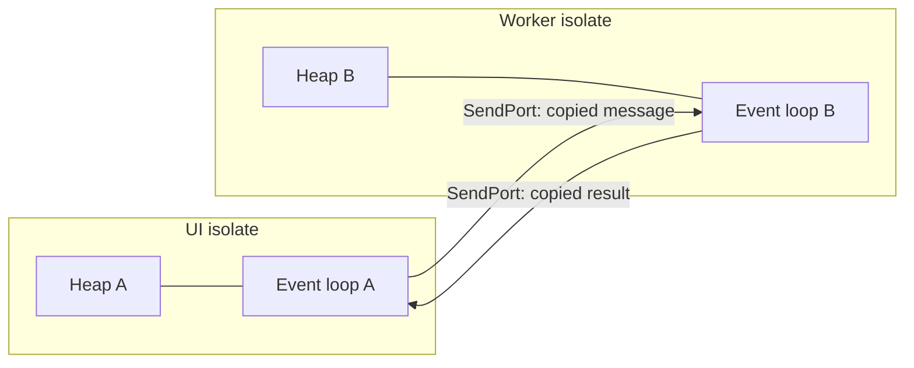

# Isolates

Moving real work off the UI isolate without freezing frames — and measuring whether you
needed to.

## The recommendation

Reach for an isolate only when you have measured a synchronous block that exceeds the frame
budget: roughly **16 ms at 60 Hz, 8 ms at 120 Hz**. Below that, the copy cost of crossing
the boundary is larger than the work you moved. Use `Isolate.run` for one-off work and a
long-lived worker for repeated work. `await` alone will not help, because an `await` yields
the thread — it does not make synchronous code faster.

## The model

An isolate has its own memory heap and its own event loop, and **no shared mutable state**
with any other isolate. That is the whole design. Isolates communicate by passing messages,
which are deep-copied on the way across.



What you get from that:

- **No locks, no races, no `volatile`.** Two isolates cannot see the same object, so there
  is nothing to synchronise. Every concurrency bug you know from Java or C++ threading
  simply does not exist.
- **Real parallelism.** Isolates run on separate OS threads, so a second isolate uses a
  second core. `async`/`await` never does — it interleaves work on one thread.

What it costs:

- **Spawning takes single-digit milliseconds and allocates a heap.** Doing it per list item
  is slower than not using an isolate at all.
- **Messages are copied**, and the copy is proportional to the object graph. Sending a
  20 MB decoded list twice a second costs more than the work it saves. `TransferableTypedData`
  moves bytes without copying and is the exception worth knowing.
- **No plugins by default.** A background isolate has no `BinaryMessenger`, so most plugin
  calls fail. `BackgroundIsolateBinaryMessenger.ensureInitialized(rootIsolateToken)` fixes
  this for plugins that support it — as of Flutter 3.24, many do not.

!!! warning "Concurrency is not parallelism"
    `async`/`await` gives you *concurrency*: the thread does something else while waiting
    for I/O. It never gives you *parallelism*. An `await` in front of a 200 ms JSON parse
    changes nothing — the parse still runs on the UI isolate and still drops twelve frames.
    Only an isolate moves it.

## Isolate.run: the default choice

For one-off work, `Isolate.run` spawns, runs, returns and shuts down:

```dart
--8<-- "dart/isolate_worker.dart"
```

`Isolate.run` (Dart 2.19+) replaces `compute` for most uses. It takes a closure rather than
a top-level function, propagates errors to the awaiting caller as real exceptions with a
merged stack trace, and does not require a Flutter dependency.

`compute(callback, message)` from `package:flutter/foundation.dart` still exists, still
works, and adds a debug timeline event so the hand-off shows up in DevTools. It requires a
top-level or static callback.

Whichever you use, the closure may only capture values that can cross an isolate boundary.
A captured `BuildContext`, plugin instance, open database handle or `SendPort`-less object
throws at spawn time. Prefer capturing nothing and passing everything as arguments.

## Long-lived workers

Spawn cost is per-spawn, so repeated work wants one isolate that stays alive. The
`IsolateWorker` in the sample above does the standard handshake:

1. The parent creates a `ReceivePort` and spawns the isolate, passing its `SendPort`.
2. The child's first message is *its own* `SendPort`. Until that arrives the parent cannot
   send anything, which is why `spawn()` is async.
3. Each job goes over with an id; each reply comes back with the same id, so replies can be
   matched to futures and can arrive out of order.
4. **Errors do not cross isolate boundaries as exceptions.** The child catches, converts to
   a message, and sends it — otherwise the caller waits on a future nobody will complete.
5. `close()` kills the isolate and fails everything in flight. Skipping it leaks an isolate
   with a live heap.

Use a worker pool — several workers and a job queue — only when you have measured that one
worker is the bottleneck. On a phone, more workers than performance cores makes things
slower, and four is usually the ceiling worth trying.

## What actually belongs on an isolate

Measured on a Pixel 6a in profile mode, the boundary sits around a millisecond of
synchronous work. Below it, the copy dominates.

| Work | Isolate? |
| --- | --- |
| Parsing a 2 MB JSON response | Yes — routinely 100 ms+ |
| Decoding, resizing or encoding images | Yes, and prefer the platform decoder where one exists |
| Cryptography: key derivation, bulk hashing | Yes |
| Parsing or diffing thousands of records | Yes |
| Regex over a large document | Yes |
| A 5 KB JSON response | No — under a millisecond, and the copy costs more |
| Awaiting HTTP or a database read | No — that is I/O, and `await` already handles it |
| A `setState` that rebuilds too much | No — that is a rendering problem, not a CPU one |

The last two rows are where isolates get misapplied. If the jank is in layout, paint or
rebuild scope, an isolate cannot help — see
[rendering performance](../part-04-production/performance-rendering.md).

## Measuring first

Do not guess. Run in **profile mode** on a real device, and:

1. Open DevTools → **Performance** and record the interaction that janks.
2. Find the long frame and look at the **UI thread** track. A wide, unbroken block of Dart
   is a candidate for an isolate. Wide **raster** work is not — that is shaders and
   compositing, and no isolate will move it.
3. Confirm with a timeline event around the suspect code:

   ```dart
   Timeline.timeSync('parseFeed', () => parseFeed(payload));
   ```

4. Move it, then measure the same interaction again. Record both numbers and the device;
   "faster" without a number is not a result.

Full workflow in [profiling](../part-04-production/performance-profiling.md).

## What you cannot do

- **Touch the UI.** Widgets, `BuildContext`, `setState`, and the renderer live on the root
  isolate. A worker returns data; the root isolate renders it.
- **Share objects.** Every message is copied. Two isolates never hold the same instance,
  so a "shared cache" between isolates is two caches.
- **Use most plugins**, unless the plugin explicitly supports background isolates and you
  have initialised the binary messenger with a root isolate token.
- **Rely on `dart:isolate` on the web.** It is unsupported. Web needs web workers, which
  Flutter does not expose through the same API — code that must run on both platforms needs
  a conditional import and a synchronous fallback.

## Interview angles

**"Why use isolates?"** To get CPU-bound work off the UI isolate so frames keep rendering.
Then the sentence that shows you understand the model: Dart has no shared-memory threading,
so isolates trade shared state for message copying — you get parallelism without locks, and
pay for it in copy cost.

**"Isolate versus async?"** `async` is concurrency on one thread and helps only with
waiting; an isolate is parallelism on another thread and helps with computing. An `await`
in front of a heavy parse changes nothing.

**"When is an isolate the wrong tool?"** When the work is I/O-bound, when the payload is
large relative to the computation, or when the jank is in raster rather than UI. Also when
the work needs plugins the background isolate cannot reach.

**"How do you decide?"** Measure in profile mode on a real device, find the block on the UI
thread, move it, measure again. Quote the frame budget: 16 ms at 60 Hz.

## See also

- [Async and concurrency](dart-async.md) — the event loop and why `await` is not a thread
- [Profiling](../part-04-production/performance-profiling.md) — the measure/change/measure loop
- [Rendering performance](../part-04-production/performance-rendering.md) — when the problem is not CPU
- [Platform channels](../part-04-production/native-platform-channels.md) — the other way off the isolate
