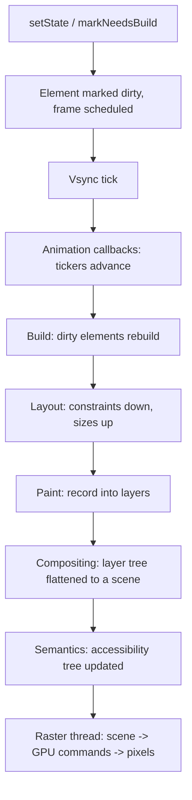

# Rendering pipeline

From `setState` to pixels: what runs, in what order, on which thread, and where a dropped
frame actually comes from.

## The recommendation

Learn the pipeline as a sequence of phases with a **budget**, not as trivia. At 60 Hz you
have 16.7 ms per frame; at 120 Hz you have 8.3 ms. That budget is split across two threads
that must *both* finish in time. When frames drop, the first question is never "what is
slow" — it is "which thread and which phase", because the fixes have nothing in common.

## What happens between setState and a pixel



The first nine steps are the **UI thread** — your Dart code and the framework. The last one
is the **raster thread**, which runs Skia or Impeller and talks to the GPU. Both must fit
inside the frame budget, and DevTools shows them as two separate bars for exactly that
reason.

### 1. The frame is scheduled, not run

`setState` does not rebuild anything. It calls `markNeedsBuild` on the element, which adds
it to a dirty list and asks `SchedulerBinding` to schedule a frame. Your code then continues
to the end of the current event, and the frame happens later, at the next vsync.

Two consequences:

- **Ten `setState` calls in one event produce one rebuild.** They mark the same element
  dirty ten times; the list is a set.
- **`setState` inside `build` is an error**, because the build phase is already running.
  The framework asserts on it.

### 2. Transient callbacks: animations advance

`SchedulerBinding` runs transient callbacks first — every `Ticker` driving an
`AnimationController` gets the new timestamp and updates its value. Listeners of those
animations mark themselves dirty here, which is why an animation that rebuilds a big subtree
is expensive *every single frame* rather than once.

`AnimatedBuilder` and `ValueListenableBuilder` exist to keep that rebuild small: pass the
expensive, unchanging subtree as `child` and the framework hands it back untouched instead
of rebuilding it 60 times a second.

### 3. Build

`WidgetsBinding.drawFrame` calls `buildScope`, which rebuilds dirty elements **in depth
order, parents before children**. Each `build` returns new widgets; each element diffs them
against the old ones and updates, replaces or skips, as described in
[the three trees](flutter-three-trees.md).

This is where "unnecessary rebuild" lives. A rebuild is cheap on its own — allocating a few
widget objects — and expensive when it cascades into layout and paint of a large subtree.

### 4. Layout

A single walk down and back up the render tree: **constraints go down, sizes come up,
parents set positions.** Flutter's layout is one pass, which is why it scales to deep trees
where a two-pass model would not. Full treatment in
[constraints and layout](constraints-and-layout.md).

Only render objects marked with `markNeedsLayout` participate. **Relayout boundaries** stop
the walk from propagating upward: if a subtree's size cannot affect its parent — because the
parent passed tight constraints — the framework knows it can relayout that subtree alone.
`SizedBox`, tight constraints, and `RepaintBoundary` in the right place all create these
boundaries for free.

### 5. Paint

Painting records drawing commands into a **layer tree**. It does not touch the GPU. Each
`RenderObject.paint` writes into a `PaintingContext`, and some render objects push a new
layer: opacity, clips, transforms, shader masks, and anything wrapped in a
`RepaintBoundary`.

**`RepaintBoundary` is the tool that makes this phase cheap.** Without one, a repaint of any
render object repaints everything sharing its layer. With one, the subtree gets its own
layer, and the compositor can reuse the cached raster of that layer when only its position
changes.

```dart
// The animation moves the box. Without the boundary, the entire static
// background repaints on every frame because it shares a layer.
RepaintBoundary(child: AnimatedLogo())
```

The cost: each layer consumes GPU memory and adds a compositing step. Wrapping every widget
in a `RepaintBoundary` makes things slower, not faster. Add one where something animates
*over* stable content, and confirm with `debugRepaintRainbowEnabled` or DevTools rather than
by feel.

### 6. Compositing and the raster thread

The layer tree is flattened into a `Scene` and handed to the raster thread, which converts
it into GPU commands. Everything after this point is out of your Dart code's hands, which is
why the fixes are different:

| Symptom in DevTools | Cause | Fix |
| --- | --- | --- |
| Long **UI** bar | Build, layout, paint, or your own Dart | Reduce rebuild scope, move work off the isolate |
| Long **raster** bar | Shader compilation, expensive clips, overdraw, huge images | Precompile shaders, simplify effects, resize images |
| Both long | Usually a very large first frame | Defer work off the first frame |

**Shader jank** is the classic raster-thread problem: the first time an animation uses a
shader it is compiled on the spot, producing one long frame the first time a user opens a
screen and never again in the same session. Impeller — the default renderer on iOS since
Flutter 3.10 and on Android since 3.29 — compiles shaders ahead of time and is the actual
fix; on the legacy Skia backend, `--purge-persistent-cache` plus SkSL warm-up was the
workaround.

## How Flutter achieves 60 FPS

Nothing about the architecture guarantees 60 FPS. What it provides is a design where hitting
it is achievable:

- **One layout pass.** No reflow loop, so cost is linear in the number of render objects
  that actually changed.
- **Boundaries everywhere.** Relayout and repaint boundaries mean a change in one subtree
  does not walk the whole tree.
- **Retained layers.** A cached layer that only moved is composited, not repainted.
- **Two threads.** Rasterisation of frame N overlaps with the UI work for frame N+1.
- **Direct rendering.** Flutter draws every pixel itself, so there is no bridge to a native
  view hierarchy on the hot path.

The framework's part is bounded work per frame. Your part is not adding unbounded work to
it — which in practice means: keep rebuild scope small, keep expensive computation off the
UI isolate, and keep images the size they are displayed at.

## Where a dropped frame comes from

In descending order of how often it is the answer in a real app:

1. **Rebuild scope too large.** `setState` at the top of a page for a change that affects
   one widget. A `ChangeNotifier` that notifies for every field. An `AnimatedBuilder` with
   no `child` argument.
2. **Expensive work inside `build`.** JSON parsing, sorting, date formatting in a loop,
   constructing a new `Random` or `Intl` formatter per item. `build` runs on the hot path;
   nothing that can be cached belongs in it.
3. **Unbounded lists.** `Column` inside `SingleChildScrollView` with 500 children builds and
   lays out all 500. `ListView.builder` builds only what is visible.
4. **Images decoded at full resolution.** A 4000×3000 photo in a 100×100 avatar decodes to
   48 MB and rasterises slowly. `cacheWidth`/`cacheHeight` or `ResizeImage` fixes it.
5. **Synchronous work on the UI isolate.** Anything above about a millisecond — see
   [isolates](dart-isolates.md).
6. **Opacity and clips in the wrong place.** `Opacity` on a large subtree forces an offscreen
   layer. `AnimatedOpacity`, `FadeTransition`, or painting a colour with alpha are cheaper.
7. **Shader compilation on first use.** One long frame, then fine.

## Debug flags worth knowing

```dart
// In main(), or toggled from DevTools.
debugPaintSizeEnabled = true;        // layout boxes and padding
debugRepaintRainbowEnabled = true;   // a colour change means that layer repainted
debugPrintBeginFrameBanner = true;   // frame boundaries in the log
debugProfileBuildsEnabled = true;    // per-widget build events in the timeline
timeDilation = 5.0;                  // slow animations down to see what actually moves
```

`debugRepaintRainbowEnabled` is the fastest way to answer "is this repainting when it should
not". If a region changes colour every frame while nothing visible in it changed, it needs a
`RepaintBoundary` or a smaller rebuild scope.

!!! warning "Measure in profile mode, on a device"
    Debug mode runs unoptimised Dart with assertions on, and is often several times slower.
    Numbers from debug mode — or from a simulator — mean nothing. `flutter run --profile` on
    real hardware, every time. See
    [profiling](../part-04-production/performance-profiling.md).

## Interview angles

**"Explain the Flutter rendering pipeline."** Vsync → animation callbacks → build → layout →
paint → compositing → raster. Say which of those are on the UI thread and which is on the
raster thread; that split is what the question is really testing.

**"Why does setState cause a rebuild?"** It marks the element dirty and schedules a frame.
The rebuild happens at the next vsync, not at the call — which is why several `setState`
calls in one event produce one rebuild.

**"How can an unnecessary rebuild happen?"** A parent rebuilding a subtree that did not
change: no `const`, an `AnimatedBuilder` without a `child`, a provider that notifies on
every field, a `ChangeNotifier` shared too widely, or a new closure identity forcing a
non-const widget. Name the fix per cause.

**"What is a RepaintBoundary?"** A render object that gives its subtree its own layer, so
repainting it does not repaint its neighbours and a moved layer can be composited rather
than repainted. Then name the cost — GPU memory and an extra compositing step — because
that is what separates a memorised answer from an applied one.

**"How does Flutter achieve 60 FPS?"** Single-pass layout, relayout and repaint boundaries,
retained layers, and a raster thread that overlaps with the next frame's UI work. Then be
honest: it does not guarantee it, and the app's own work is usually what breaks it.

**"The app is dropping frames — what do you do?"** Reproduce in profile mode on a real
device, record a timeline, and check which bar is long. UI-thread work and raster-thread
work have entirely different fixes, and guessing without that split wastes the afternoon.

## See also

- [Widgets, elements and render objects](flutter-three-trees.md) — what is being diffed
- [Constraints and layout](constraints-and-layout.md) — the layout phase in detail
- [Rendering performance](../part-04-production/performance-rendering.md) — the fixes, measured
- [Profiling](../part-04-production/performance-profiling.md) — the DevTools workflow
