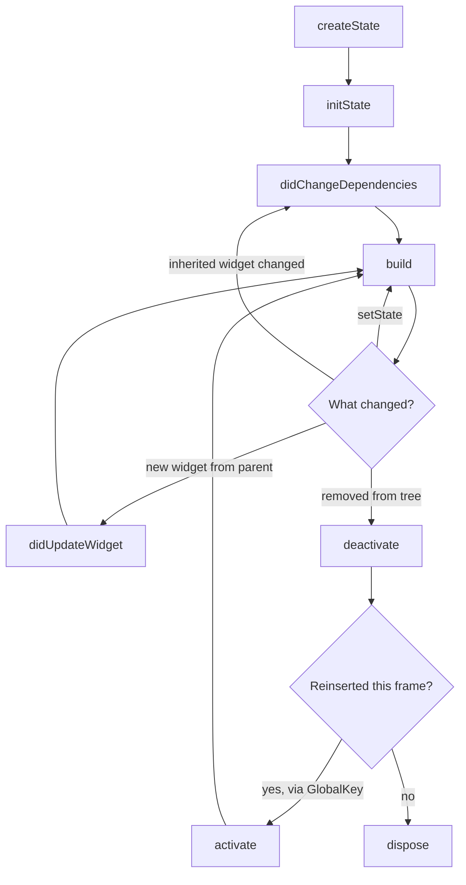

# Widget lifecycle

Every `State` callback in the order it fires, what belongs in each, and why a
`BuildContext` after an `await` is the most common crash in a Flutter codebase.

## The recommendation

Put subscriptions, controllers and one-shot work in `initState`; put anything that reads an
inherited widget in `didChangeDependencies`; react to configuration changes in
`didUpdateWidget`; and release everything in `dispose`. After any `await`, check `mounted`
before touching `setState`, `context`, or a controller.

## The order, asserted



The sample below records each callback as it fires, and a test asserts the sequences:

```dart
--8<-- "flutter/lifecycle_probe.dart"
```

Mounting produces `initState → didChangeDependencies → build`. A new widget from the parent
produces `didUpdateWidget → build`. A `setState` produces `build` alone. Removal produces
`deactivate → dispose`. Those are test assertions in `code/testing/lifecycle_probe_test.dart`,
not recollections.

## What belongs in each callback

### createState

Called once per element. Return a fresh `State`. Nothing else — `context` does not exist
yet, and `widget` is not set.

### initState

Called once, before the first build. `widget` is available; **`context` exists but must not
be used to look up inherited widgets**, because dependencies cannot be registered yet.

```dart
@override
void initState() {
  super.initState();                                    // first, always
  _controller = AnimationController(vsync: this, duration: _kDuration);
  _subscription = repository.watch(widget.id).listen(_onData);
  _future = repository.load(widget.id);                 // not in build
}
```

The rule that catches people: **`Theme.of(context)` and `MediaQuery.of(context)` throw here**
(or, worse, silently fail to register a dependency). Move them to
`didChangeDependencies`. `context.read<T>()` is fine, because it does not subscribe;
`context.watch<T>()` is not.

Starting a future in `initState` and storing it in a field is correct. Calling
`repository.load()` inside `build` is the anti-pattern — `build` can run many times per
second, and each run starts a new request.

### didChangeDependencies

Called immediately after `initState`, and again whenever an inherited widget this `State`
depends on changes. That is where the callback earns its existence: `initState` cannot react
to a theme change, a locale change, or a new value from a `Provider`.

```dart
@override
void didChangeDependencies() {
  super.didChangeDependencies();
  final locale = Localizations.localeOf(context);
  if (locale != _locale) {
    _locale = locale;
    _reloadTranslatedContent();  // guard, or this runs on every dependency change
  }
}
```

It can fire several times. Anything expensive in it needs a guard on what actually changed.

### build

Called whenever the element is dirty. Must be **pure and fast**: build widgets from state,
and nothing else. No network calls, no `setState`, no timers, no side effects, no expensive
computation. Assume it runs 60 times a second, because sometimes it does.

### didUpdateWidget

Called when the parent supplies a new widget of the same type and key. The `State` survives;
its configuration changed. Anything derived from a widget field must be rebuilt here:

```dart
@override
void didUpdateWidget(covariant UserPage oldWidget) {
  super.didUpdateWidget(oldWidget);
  if (oldWidget.userId != widget.userId) {
    _subscription?.cancel();                        // old one first
    _subscription = repository.watch(widget.userId).listen(_onData);
  }
}
```

Skipping this is a silent bug: the widget shows user B's id in its configuration and user
A's data on screen, because the subscription was created in `initState` and never revisited.
Always compare against `oldWidget` — reacting unconditionally restarts the work on every
parent rebuild.

### deactivate and activate

`deactivate` fires when the element is removed from the tree. It may be reinserted in the
same frame — that is what happens when a `GlobalKey` moves a subtree — in which case
`activate` follows and the `State` continues. Because reinsertion is possible, `deactivate`
is not the place to release resources.

### dispose

Last call, always. `mounted` is already false. Release everything you acquired:

```dart
@override
void dispose() {
  _subscription?.cancel();
  _controller.dispose();
  _debouncer.dispose();
  _focusNode.dispose();
  _scrollController.dispose();
  super.dispose();               // last, always
}
```

The symmetry rule is the one to internalise: **anything created in `initState` or
`didUpdateWidget` is released in `dispose`.** Streams, animation controllers, timers, focus
nodes, scroll controllers, text editing controllers, platform listeners, `Ticker`s. Every
one of those keeps a reference to a closure that keeps your `State` alive, so a missed
`dispose` is both a leak and a crash waiting for the callback to fire.

## Why BuildContext is dangerous after an await

A `BuildContext` **is** an element. After the element is unmounted, that element is dead:
`context.mounted` is false, its ancestors are gone, and any lookup through it either throws
or — worse — silently walks a detached tree.

```dart
// The bug, in the shape it usually ships in.
Future<void> _save() async {
  await repository.save(_form);
  Navigator.of(context).pop();                       // user already navigated away
  ScaffoldMessenger.of(context).showSnackBar(...);   // "no ScaffoldMessenger found"
}
```

The gap across an `await` can be arbitrarily long, and during it the user can tap back, the
route can be popped, a parent can rebuild the subtree away, or the app can be backgrounded
and the page discarded. Under a fast network in the simulator, it never reproduces.

The fix is a guard on every path that resumes after suspension:

```dart
Future<void> _save() async {
  final messenger = ScaffoldMessenger.of(context);   // capture before the await
  final navigator = Navigator.of(context);

  await repository.save(_form);
  if (!mounted) return;                              // then guard

  navigator.pop();
  messenger.showSnackBar(const SnackBar(content: Text('Saved')));
}
```

Two techniques, and both matter:

- **Capture what you need before the `await`.** `ScaffoldMessenger.of(context)` resolved
  before suspension is a plain object that stays valid.
- **Guard with `mounted` after it.** In a `State`, `mounted` is the field. In a widget with
  only a context — a callback, a `Builder` — use `context.mounted`, added in Flutter 3.7.

The `use_build_context_synchronously` lint catches most cases. Leave it on. When it fires
and the code looks fine, it is usually right and you are usually about to ship the crash.

## App lifecycle, as distinct from widget lifecycle

Separate axis: the OS suspending and resuming your app.

```dart
class _HomeState extends State<Home> with WidgetsBindingObserver {
  @override
  void initState() {
    super.initState();
    WidgetsBinding.instance.addObserver(this);
  }

  @override
  void dispose() {
    WidgetsBinding.instance.removeObserver(this); // or the observer outlives the State
    super.dispose();
  }

  @override
  void didChangeAppLifecycleState(AppLifecycleState state) {
    switch (state) {
      case AppLifecycleState.resumed:  _resumePolling();
      case AppLifecycleState.inactive: break;      // transitional — do not act on it
      case AppLifecycleState.hidden:   break;
      case AppLifecycleState.paused:   _flushPendingWrites();
      case AppLifecycleState.detached: break;      // may not run at all
    }
  }
}
```

Do work that must survive the app being killed in `paused` — flushing a draft, saving a
cursor position. Do not rely on `detached`: on both platforms the process can be killed
without it.

## Interview angles

**"Walk me through the widget lifecycle."** `createState → initState →
didChangeDependencies → build`, then `didUpdateWidget` or `didChangeDependencies` on
changes, then `deactivate → dispose`. Mention that `deactivate` can be followed by
`activate` — most candidates do not know that branch exists.

**"`initState` versus `didChangeDependencies`?"** `initState` runs once and cannot safely
read inherited widgets; `didChangeDependencies` runs after it and again on every dependency
change, which is where `Theme.of` and `MediaQuery.of` belong.

**"Why is BuildContext dangerous after an await?"** Because it is an element, and the
element can be unmounted while the future is in flight. Then give the fix: capture what you
need before the await, guard with `mounted` after it.

**"What does didUpdateWidget solve?"** Reacting to a configuration change without losing
`State` — re-subscribing when the id changes, retargeting an animation. The failure mode is
stale data behind fresh configuration.

**"What happens if you forget dispose?"** The controller or subscription outlives the
widget: a leak, plus a callback that eventually calls `setState` on a disposed `State` and
crashes. Give the timer example.

## See also

- [Widgets, elements and render objects](flutter-three-trees.md) — why context is an element
- [Async and concurrency](dart-async.md) — what an `await` actually suspends
- [Memory](../part-04-production/performance-memory.md) — leak sources and leak tests
- [Widget lifecycle cheatsheet](../cheatsheets/widget-lifecycle.md) — the one-page version
