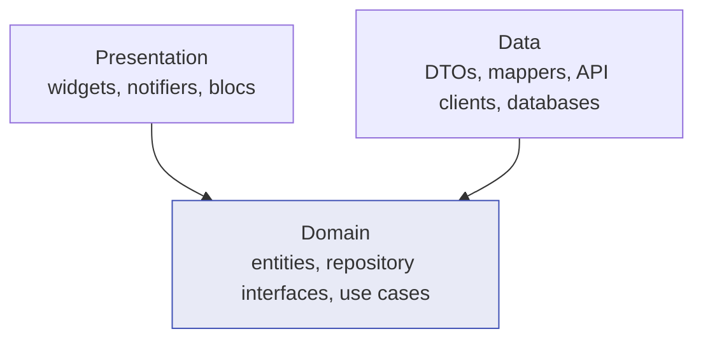

# Clean Architecture

Presentation, domain and data — what each layer owes the others, and the honest answer to
when the whole thing is overkill.

## The recommendation

Adopt three layers with **one rule enforced**: the domain layer imports nothing from
outside itself. Not dio, not Drift, not Flutter. Everything else — use cases, mappers,
separate DTO classes — is optional and should be added when a specific pain appears, not
because a diagram says so.

## The layers



Both arrows point **inward**. The domain is the only layer with no dependencies, which is
what makes it the only layer that survives a change of HTTP client, database, or state
management approach.

| Layer | Contains | Knows about | Must never contain |
| --- | --- | --- | --- |
| Presentation | Widgets, notifiers, blocs, view models | Domain | HTTP, SQL, JSON keys |
| Domain | Entities, repository *interfaces*, use cases, domain failures | Nothing | Flutter, packages, `BuildContext` |
| Data | DTOs, mappers, API clients, DAOs, repository *implementations* | Domain | Widgets |

The inversion that makes it work: the repository **interface** lives in the domain, and its
**implementation** lives in the data layer. The domain declares what it needs; the outer
layer supplies it. Without that, "domain" is just a folder name.

One feature, all four pieces:

```dart
--8<-- "architecture/user_feature.dart"
```

## Entity vs model vs DTO

The question every interview asks, and the one most codebases get wrong by having only one
class doing all three jobs.

| | DTO | Entity |
| --- | --- | --- |
| Shape follows | The wire — the server's field names and nullability | The app's rules |
| Nullability | Whatever the server can actually send | Non-null wherever the app requires a value |
| Contains | `fromJson`, `toJson` | Domain behaviour and invariants |
| Changes when | The API changes | The product changes |
| Lives in | Data | Domain |

In the sample above `UserDto.email` is `String?` because the server can omit it, while
`User.email` is `String` because the app has no meaning for a user without one. The
**mapper** is the single place that reconciles the two, and the place a broken payload is
converted into a typed failure. That reconciliation is the entire value of the separation:
a bad response fails in the parser with the payload in scope, instead of throwing a null
error in a widget three screens away.

"Model" is the ambiguous word. In this handbook it means a DTO. If your team uses it to
mean an entity, write that down somewhere — the ambiguity itself causes review arguments.

### When one class is fine

When the API is yours, stable, and shaped like your domain — an internal admin tool, a
prototype, a feature with three fields — one class with `fromJson` is fine and two is
ceremony. The moment the server adds a field you must ignore, renames one, or starts
sending null where it promised not to, split them. That moment is obvious when it arrives.

## Use cases

A use case is one verb with its own logic. `RenameUser` in the sample validates before it
calls the repository, and that validation now has exactly one home and one test.

**Write a use case when** the operation has a rule of its own, orchestrates more than one
repository, or is shared by more than one screen.

**Skip it when** it forwards a single call. `class GetUser { call(id) => repo.byId(id); }`
is a file, an import, a constructor parameter and a mock, all to add nothing. Let the
presentation layer call the repository directly, and add the use case when a rule appears.

That is the pragmatic deviation from textbook Clean Architecture, and it is worth defending
in a review: layers exist to isolate change, and a pass-through class isolates nothing.

## Dependency rule, enforced

A rule nobody checks is a rule that decays within a quarter. Two ways to make it real:

**Analyzer rules**, cheapest:

```yaml
# analysis_options.yaml
dart_code_metrics:
  rules:
    - avoid-importing-entrypoint-exports
    - prefer-match-file-name
```

**Package boundaries**, strongest: put the domain in its own package with only `meta` in its
dependencies. Then an import of `dio` from the domain does not compile, and no reviewer has
to notice. See [modularization](../part-05-enterprise/modularization.md).

## Avoiding circular dependencies

Circles happen when two features reach into each other — `orders` imports `users` for the
customer name while `users` imports `orders` for the purchase history. Three fixes, in
order:

1. **Depend on the domain, not the feature.** Both features import the shared entity from a
   common domain module. Nobody imports a sibling's presentation or data layer.
2. **Invert with an interface.** The feature that needs the behaviour declares the interface
   it wants; the other feature implements it and is wired at composition root.
3. **Emit an event.** For "when an order ships, notify the user", publish a domain event
   rather than calling across.

The structural version of the rule: **features never import each other.** Anything two
features share moves down into `core/` or a shared package. That single constraint prevents
most circles before they form.

## SOLID, briefly, in Flutter terms

Worth stating in the vocabulary the code actually uses:

- **Single responsibility** — a widget that fetches, parses and renders has three reasons to
  change. Split by reason to change, not by line count.
- **Open/closed** — new payment methods should be new sealed subtypes and a new `switch`
  branch that the compiler demands, not an edit to a chain of `if`s.
- **Liskov** — a fake repository must honour the real contract, including its failure modes.
  A fake that never throws makes green tests and a red production.
- **Interface segregation** — `UserApi` and `UserCache` are separate in the sample so a
  cache-only test does not implement six network methods.
- **Dependency inversion** — the repository interface in the domain. This is the one that
  carries the architecture; the rest are hygiene.

## The cost

Name it before you adopt it, because reviewers will:

- **More files per feature.** Roughly four to six instead of one. Navigation slows, and new
  hires ask where things go for their first month.
- **Mapping code.** DTO ↔ entity conversion is real code with real bugs, and it is boring.
- **Indirection when debugging.** A stack trace crosses three layers before it reaches the
  thing that failed.
- **Refactor friction.** Adding one field touches the DTO, the mapper, the entity, and
  sometimes a use case.

What it buys: a data layer you can replace without touching the UI, a domain you can test
with no mocks at all, and features that can be worked on by different people without
merge conflicts. On a team of five with a two-year horizon, that trade is clearly worth it.
On a solo two-month project, it is clearly not.

## When it is overkill

- A prototype, or anything you would be happy to rewrite.
- An app that is mostly a thin client over one stable API with no offline mode.
- A team of one or two who ship weekly and have never been blocked by coupling.
- Any screen where the "domain logic" is `if (list.isEmpty)`.

The middle path most apps should actually take: **repository plus entity, no use cases, no
separate DTO until the API forces one.** That is two concepts, keeps the seam where it
matters — swapping the data source and testing without a network — and can grow into full
layering the day it needs to.

## Interview angles

**"Explain Clean Architecture."** Three layers with dependencies pointing inward, and the
domain depending on nothing. Then immediately name what it buys and what it costs; reciting
the diagram without the tradeoff is the mid-level answer.

**"Why a repository?"** It is the seam. It lets the domain state what it needs without
knowing whether the answer comes from HTTP, SQLite, or a cache, and it is the one place the
cache-versus-network policy can live.

**"Entity versus model?"** An entity is shaped by the app's rules and is non-null where the
app requires a value; a DTO is shaped by the wire and nullable wherever the server can omit
a field. The mapper between them is where a broken payload becomes a typed failure.

**"Why a DTO at all?"** So an API change is a one-file change, and so a malformed response
fails at the boundary with the payload in scope rather than in a widget.

**"How do you avoid circular dependencies?"** Features never import each other; shared
concepts move into a common module, and cross-feature needs are inverted behind an
interface or expressed as an event. Package boundaries make it a compile error rather than
a convention.

## See also

- [Project structure](project-structure.md) — where these layers live on disk
- [Dependency injection](dependency-injection.md) — how implementations reach interfaces
- [Error handling](error-handling.md) — the `Result` type used above
- [Modularization](../part-05-enterprise/modularization.md) — enforcing the rule with packages
