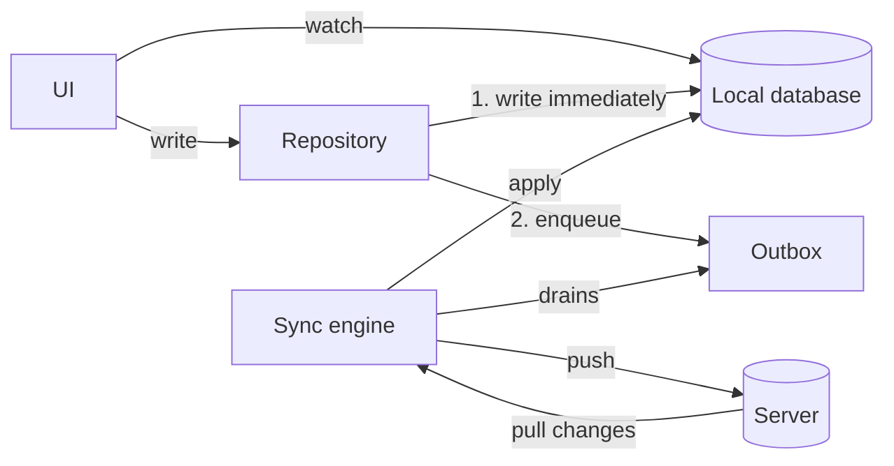

# Offline first

Designing for a network that is not there, then syncing without losing a write.

## The recommendation

**The local database is the source of truth for the UI; the network is a synchroniser.**
Every read comes from local storage, every write lands in local storage first and is queued
for the server, and the UI never waits on a request to show something. That single inversion
is what separates an app that works on a train from one that shows a spinner.

## The architecture



Three properties follow, and each maps to a user-visible behaviour:

- **Reads never fail.** The database always answers. Offline means stale, not broken.
- **Writes never block.** The row changes locally, the UI updates immediately, and delivery
  happens later.
- **Sync is a background process with its own retry policy**, not something a screen owns.

## Read strategies

Choose per screen, not per app:

| Strategy | Behaviour | Right for |
| --- | --- | --- |
| **Cache-first** | Serve cache; fetch only if missing or stale | Reference data, product catalogues |
| **Stale-while-revalidate** | Serve cache immediately, refresh in background, update when it lands | Feeds, lists, most screens |
| **Network-first** | Try network, fall back to cache | Balances, prices — anything where stale misleads |
| **Cache-only** | Never fetch | Explicit offline mode, drafts |

Stale-while-revalidate is the default worth reaching for: the screen paints instantly and
corrects itself a moment later. The cost is a visible content shift, so pin the scroll
position and avoid re-sorting under the user's finger.

**Always show the age of what is stale.** "Updated 2 hours ago" is the difference between a
user trusting the app and a user thinking it is broken.

## The outbox pattern

A write goes into a durable queue in the same transaction as the local change:

```dart
class OutboxEntry {
  final String id;             // client-generated UUID — also the idempotency key
  final String operation;      // 'create_order', 'rename_user'
  final Map<String, Object?> payload;
  final DateTime createdAt;
  int attempts;
  String? lastError;
}

Future<void> renameUser(String userId, String name) async {
  await db.transaction(() async {
    await db.users.update(userId, name: name, pendingSync: true);
    await db.outbox.insert(OutboxEntry(
      id: uuid.v4(),
      operation: 'rename_user',
      payload: {'userId': userId, 'name': name},
      createdAt: clock.now(),
    ));
  });
  unawaited(syncEngine.kick());     // try now; the queue survives if it fails
}
```

The properties that make it work:

- **One transaction.** The local change and the queue entry commit together, or neither does.
  Two separate writes mean a crash between them loses the sync.
- **Client-generated ids.** The UUID is created on the device, so the entity has an identity
  before the server sees it, and the same id doubles as the idempotency key.
- **The queue is ordered and drained sequentially per entity.** Renaming twice must arrive in
  order; parallel draining reverses them roughly one time in ten.
- **Attempts and last error are stored**, so the UI can show "3 items failed to sync" instead
  of failing silently.
- **Poison messages get a ceiling.** After N attempts, park the entry and surface it. An
  entry the server will always reject blocks the queue behind it forever.

## Optimistic updates

The user's action takes effect immediately; the server confirms or reverts it.

```dart
Future<void> toggleLike(String postId) async {
  final previous = state.value!;
  state = AsyncData(previous.copyWith(liked: !previous.liked));   // instant

  final result = await repository.setLike(postId, !previous.liked);
  if (result is Failure) {
    state = AsyncData(previous);                                   // roll back
    messenger.show('Could not save. Try again.');
  }
}
```

Three rules:

1. **Only be optimistic about things that usually succeed and are cheap to undo.** A like, a
   rename, marking as read. Never a payment.
2. **Keep the previous value** for the rollback. A rollback that recomputes from scratch will
   also discard whatever else changed in the meantime.
3. **Tell the user when it reverts.** A silent rollback looks like the app losing data,
   because from the user's point of view that is exactly what happened.

The Riverpod sample in [state management](../part-02-professional/state-management-riverpod.md)
implements exactly this, with a test for the rollback path.

## Conflict resolution

Two devices edited the same record. Pick a policy per entity, before you write the sync code
— the code is easy and the policy is the hard part.

| Policy | How | Right for | Loses |
| --- | --- | --- | --- |
| **Last write wins** | Compare timestamps, newest survives | Settings, single-user data | The older edit, silently |
| **Server wins** | Discard the local change | Prices, inventory, anything authoritative | The user's edit |
| **Client wins** | Force-push local | Drafts, local-only fields | Concurrent server changes |
| **Field-level merge** | Per-field newest | Profiles, forms with independent fields | Little, but needs per-field timestamps |
| **Ask the user** | Show both, let them choose | Documents, notes | Nothing, but it costs UX |
| **CRDT** | Convergent data structures | Collaborative editing | Nothing, at high complexity |

Practical advice for a normal app: **last write wins with server-assigned versions**, and
field-level merge for the two or three entities where losing an edit would matter.

Use a **version or ETag**, not a wall-clock timestamp, to detect conflicts: device clocks are
wrong, sometimes by hours, and a device with a fast clock wins every conflict forever.

```dart
// The server rejects with 409 if `version` is not current.
final response = await api.patch(url, body: {...payload, 'version': local.version});
if (response.statusCode == 409) {
  await resolveConflict(local, remote: parse(response.body));
}
```

## Delta sync

Full sync does not scale past a few thousand rows. Ask for what changed:

```dart
final since = await db.meta.lastSyncCursor();
final changes = await api.get('/sync', queryParameters: {'since': since});

await db.transaction(() async {
  for (final change in changes.items) {
    change.deleted
        ? await db.orders.delete(change.id)
        : await db.orders.upsert(change.toRow());
  }
  await db.meta.setLastSyncCursor(changes.cursor);   // only after applying
});
```

Two details worth insisting on with the backend team:

- **Tombstones.** A deletion must be an entry in the change feed. Without them, a record
  deleted on another device lives forever on this one.
- **The cursor advances only after the batch commits.** Advancing first means a crash
  mid-apply skips those changes permanently.

## Surfacing sync state

Offline apps fail in ways users need to see:

- **A connection indicator**, but only when offline. A permanent "online" badge is noise.
- **Per-item pending state.** A greyed row or a small clock icon on anything not yet
  confirmed.
- **A failure count with an action.** "2 changes could not be sync" plus a retry, never a
  silent drop.
- **The age of the data.** "Updated 5 minutes ago" on any screen showing cached content.

`connectivity_plus` reports whether an interface exists, **not whether the internet works** —
captive portals and dead uplinks both report connected. Treat it as a hint that triggers a
sync attempt, and let the actual request decide.

## Testing offline behaviour

The parts worth having tests for, because manual testing misses them:

- **Queue survives a restart.** Write, kill the process, reopen, assert the outbox drains.
- **Ordering.** Two edits to the same entity arrive in the order they were made.
- **Idempotency.** Delivering the same entry twice produces one server-side effect.
- **Conflict.** A 409 triggers your resolution path and leaves the database consistent.
- **Poison entries.** An entry rejected N times parks itself and does not block the queue.

## Interview angles

**"How would WhatsApp work offline?"** Local database as the source of truth, messages
written locally with a client-generated id and a pending state, an outbox draining in order
when connectivity returns, and delta sync with tombstones on reconnect. Then the detail that
shows depth: the message id is generated on the device, so retries are idempotent and the
same message cannot arrive twice.

**"How do you sync offline data?"** Outbox for writes, delta sync with a cursor for reads,
both in transactions, with a conflict policy chosen per entity. Name versions rather than
timestamps for conflict detection, and say why: device clocks are wrong.

**"Explain optimistic updates."** Apply locally first, keep the previous value, confirm or
roll back on the server's answer, and tell the user when it reverts. Say what it is not for:
payments and anything expensive to undo.

**"How do you handle conflicts?"** Name the policies and pick per entity. The senior part of
the answer is that it is a product decision — "which edit should win" is a question for the
person who owns the feature, not a technical default.

## See also

- [Networking](networking.md) — retries and idempotency keys
- [SQLite](sqlite.md) and [Drift](drift.md) — transactions and reactive queries
- [Riverpod](../part-02-professional/state-management-riverpod.md) — the optimistic update
- [Mobile system design](../part-06-interviews/system-design.md) — sync in a full design
