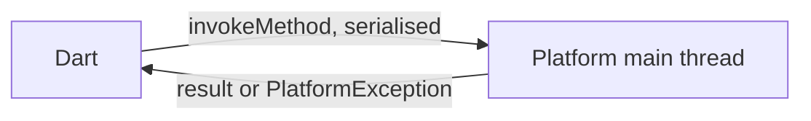

# Platform channels

MethodChannel, EventChannel, and Pigeon — how Dart reaches the platform, and where the
boundary bites.

## The recommendation

**Use Pigeon for anything beyond a couple of methods.** Hand-written channels are stringly
typed on both sides: a renamed method or a changed argument type fails at runtime on one
platform, in release, on a user's device. Pigeon generates matching Dart, Kotlin and Swift
from one definition, so the mismatch becomes a compile error.

## What a channel is

A named, asynchronous message pipe between the Dart isolate and the platform's main thread.
Messages are serialised by a codec — the standard one handles null, bool, num, String,
`Uint8List`, `List` and `Map`. Anything else you encode yourself.



Two facts that determine the design:

- **It is always asynchronous.** Even a trivial call is a future. There is no synchronous
  channel API, deliberately — a synchronous hop would block the UI isolate.
- **The native side runs on the platform main thread.** Blocking work there freezes the
  platform UI, which on Android is also where your Flutter view lives. Dispatch to a
  background thread or queue natively and post the result back.

## MethodChannel

```dart
class BatteryService {
  static const _channel = MethodChannel('com.example.app/battery');

  Future<int> level() async {
    try {
      // The return type is dynamic across the boundary — cast explicitly, and
      // do it here rather than letting `dynamic` travel inward.
      final level = await _channel.invokeMethod<int>('getBatteryLevel');
      if (level == null) throw const BatteryUnavailable();
      return level;
    } on PlatformException catch (e) {
      throw switch (e.code) {
        'UNAVAILABLE' => const BatteryUnavailable(),
        _ => BatteryFailure(e.message ?? 'unknown'),
      };
    } on MissingPluginException {
      // The platform side is not registered — a different platform, or a hot
      // restart after adding the handler. Handle it, do not crash.
      throw const BatteryUnavailable();
    }
  }
}
```

Kotlin:

```kotlin
MethodChannel(flutterEngine.dartExecutor.binaryMessenger, "com.example.app/battery")
  .setMethodCallHandler { call, result ->
    when (call.method) {
      "getBatteryLevel" -> {
        val level = batteryLevel()
        if (level >= 0) result.success(level)
        else result.error("UNAVAILABLE", "Battery level unavailable", null)
      }
      // Without this, an unknown method hangs the Dart future forever.
      else -> result.notImplemented()
    }
  }
```

Swift:

```swift
let channel = FlutterMethodChannel(name: "com.example.app/battery",
                                   binaryMessenger: controller.binaryMessenger)
channel.setMethodCallHandler { call, result in
  switch call.method {
  case "getBatteryLevel":
    result(UIDevice.current.batteryLevel >= 0 ? Int(UIDevice.current.batteryLevel * 100)
                                              : FlutterError(code: "UNAVAILABLE",
                                                             message: nil, details: nil))
  default:
    result(FlutterMethodNotImplemented)
  }
}
```

**Call `result` exactly once, on every path.** Calling it twice crashes on Android; not
calling it at all leaves the Dart future pending forever, which surfaces as a screen stuck on
a spinner with no error anywhere.

Name channels with a reverse-domain prefix. Channel names are global to the engine, and two
plugins picking `battery` collide silently.

## EventChannel

For a stream of values pushed *from* native: sensors, location, connectivity, download
progress, Bluetooth scans.

```dart
static const _events = EventChannel('com.example.app/location');

Stream<Position> watch() => _events
    .receiveBroadcastStream()
    .map((event) => Position.fromMap((event as Map).cast<String, Object?>()));
```

```kotlin
EventChannel(messenger, "com.example.app/location").setStreamHandler(
  object : EventChannel.StreamHandler {
    override fun onListen(args: Any?, events: EventChannel.EventSink) {
      listener = LocationListener { events.success(it.toMap()) }
      locationManager.requestUpdates(listener)     // start when someone listens
    }
    override fun onCancel(args: Any?) {
      locationManager.removeUpdates(listener)      // stop when nobody does
      listener = null
    }
  }
)

```

`onListen`/`onCancel` are the resource lifecycle. Starting the sensor at plugin registration
instead drains the battery of every user who never opened that screen, and it is a common
review finding.

The Dart side must cancel its subscription in `dispose`, or `onCancel` never fires.

**MethodChannel versus EventChannel**, stated for interviews: MethodChannel is
request/response, one result per call, initiated from Dart. EventChannel is a continuous
stream, zero to many events, pushed from native, with an explicit start and stop.

There is also **BasicMessageChannel** — bidirectional messages with no method concept — which
is what you want for a symmetric protocol rather than an RPC.

## Pigeon

```dart
// pigeons/battery.dart — the single definition
@HostApi()
abstract class BatteryApi {
  int getLevel();
  bool isCharging();
}

@FlutterApi()          // native calls Dart
abstract class BatteryEvents {
  void onLevelChanged(int level);
}
```

```bash
dart run pigeon --input pigeons/battery.dart \
  --dart_out lib/src/battery.g.dart \
  --kotlin_out android/src/main/kotlin/BatteryApi.kt \
  --swift_out ios/Runner/BatteryApi.swift
```

What that buys, and it is a lot:

- **Type safety on all three sides.** Add an argument and the Kotlin file no longer compiles
  until you implement it — the failure moves from a user's device to your build.
- **No string method names**, so no typos and no silent `notImplemented`.
- **Structured data classes** generated in each language, instead of maps you cast by hand.
- **Errors that map to `PlatformException`** without hand-written codes.

The cost is a generation step and a `pigeons/` directory to keep in sync. Past two methods it
is cheaper than the hand-written version; below that it is ceremony.

## Performance and threading

- **Channel calls are not free.** Serialisation plus a thread hop is tens of microseconds —
  fine per interaction, expensive per frame. A channel call in a scroll callback is a jank
  source; batch instead.
- **Large payloads should be `Uint8List`.** Binary transfers without per-element encoding; a
  list of 100,000 ints does not.
- **Background isolates have no messenger by default.** Use
  `BackgroundIsolateBinaryMessenger.ensureInitialized(rootIsolateToken)`, and note that plugin
  support for it varies — see [isolates](../part-01-foundations/dart-isolates.md).

## Testing

```dart
TestDefaultBinaryMessengerBinding.instance.defaultBinaryMessenger
    .setMockMethodCallHandler(
  const MethodChannel('com.example.app/battery'),
  (call) async => switch (call.method) {
    'getBatteryLevel' => 42,
    _ => null,
  },
);
```

That covers your Dart wrapper, which is the part with the parsing and error mapping. The
native implementation needs native tests (JUnit, XCTest) or an
[integration test](../part-02-professional/testing-integration.md) on a device — a mocked
channel proves nothing about the Kotlin.

## Interview angles

**"Why use platform channels?"** To reach platform APIs Flutter does not wrap — sensors,
Bluetooth, background services, SDKs with no Dart binding — and to reuse existing native code.

**"MethodChannel versus EventChannel?"** Request/response initiated from Dart, versus a
continuous stream pushed from native with `onListen`/`onCancel` as the resource lifecycle.

**"What goes wrong with channels?"** Not calling `result` on some path, which hangs the Dart
future with no error; blocking the platform main thread; unhandled `MissingPluginException`;
and stringly-typed method names that fail only at runtime — which is the argument for Pigeon.

**"How do you handle errors across the boundary?"** `result.error(code, message, details)`
natively becomes `PlatformException` in Dart; map it to a domain failure at the wrapper so
nothing above the data layer knows a channel exists.

## See also

- [Dart FFI](native-ffi.md) — when a channel is the wrong tool
- [Writing plugins](native-plugins.md) — packaging this for reuse
- [Isolates](../part-01-foundations/dart-isolates.md) — channels from a background isolate
- [Integration tests](../part-02-professional/testing-integration.md) — testing the native side
