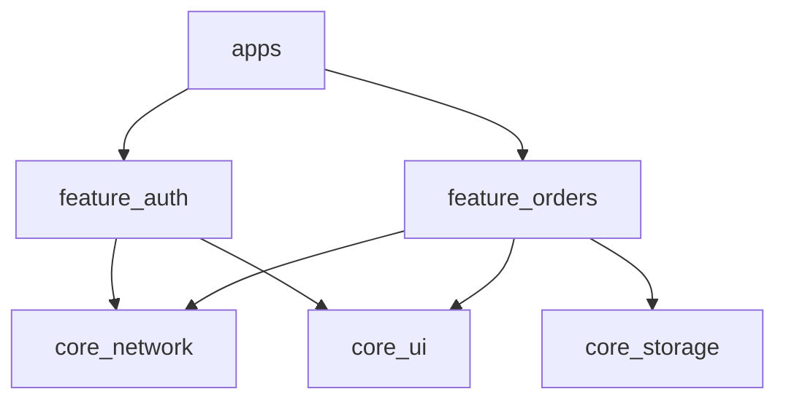

# Modularization

Splitting a monolith into packages without creating a dependency swamp.

## The recommendation

**Split when a boundary needs enforcing, not when the folder count feels high.** Packages buy
you compile-time enforcement, independent testing and clear ownership; they cost version
coordination, slower cold builds and a `melos bootstrap` in every onboarding doc. For one app
and four developers, folders are enough. At fifteen engineers, or two apps sharing code, they
stop being enough.

## What actually justifies a package

| Signal | What the package fixes |
| --- | --- |
| The dependency rule keeps being broken | The illegal import stops compiling |
| Two apps share code — white label, staff app | One source of truth, versioned |
| A team owns a domain end to end | CODEOWNERS on a real boundary |
| Cold builds and test runs are painful | Test and build only what changed |
| A module could be extracted or open sourced | Clean seams and a real public API |

Note what is *not* on that list: file count, folder depth, or an article recommending it.

## Layout

```text
melos.yaml
pubspec.yaml
apps/
  customer_app/          # composes packages, owns flavours and entry point
  staff_app/
packages/
  core_ui/               # design system — no business logic
  core_network/          # dio setup, interceptors, error mapping
  core_storage/          # database, secure storage
  feature_auth/          # one feature, all its layers
  feature_orders/
```

The dependency rule, and it is the whole design:



**Apps depend on features. Features depend on core. Features never depend on each other.**
That last rule is what a package boundary makes enforceable — an import of `feature_auth` from
`feature_orders` fails to resolve, because it is not in the pubspec.

When two features genuinely need to share, the shared concept moves down into core, or the
need is inverted behind an interface declared where it is used. Same rule as
[project structure](../part-02-professional/project-structure.md), now with a compiler behind
it.

## Melos

```yaml
# melos.yaml
name: my_workspace
packages:
  - apps/**
  - packages/**

command:
  bootstrap:
    usePubspecOverrides: true   # local path overrides without editing pubspecs

scripts:
  analyze:
    run: melos exec -- flutter analyze
  test:
    run: melos exec --dir-exists=test -- flutter test
  test:changed:
    run: melos exec --diff=origin/main --dir-exists=test -- flutter test
  format:
    run: melos exec -- dart format .
  generate:
    run: melos exec --depends-on=build_runner -- dart run build_runner build --delete-conflicting-outputs
```

```bash
dart pub global activate melos
melos bootstrap        # link local packages, resolve everything
melos run test:changed # test only what this branch touched
```

`--diff=origin/main` is the payoff at scale: CI runs the tests for the packages a branch
actually touched, plus their dependents, instead of the whole workspace. That is the
difference between a five-minute pipeline and a thirty-minute one.

Dart 3.6's native pub workspaces cover some of what Melos does. Check whether you still need
Melos before adding it — the versioning and scripting are the parts that remain useful.

## Designing a package's public API

A package without an intentional public API is a folder with extra steps.

```dart
// packages/feature_orders/lib/feature_orders.dart — the only entry point
export 'src/domain/order.dart';
export 'src/domain/order_repository.dart';
export 'src/presentation/orders_page.dart';
// src/data/** is deliberately not exported: nothing outside may construct a
// repository implementation or see a DTO.
```

Everything else lives under `src/`, which the analyzer flags when imported across a package
boundary. Two habits keep this honest: **export types, not implementations**, and **treat
adding an export as an API decision** — it is much easier to add one later than to remove one
people are using.

## Versioning

Two models, and the choice matters more than it looks:

**Fixed (lockstep).** Every package shares one version, bumped together. Simple, no
compatibility matrix, and any change means releasing everything. Right for a monorepo where
all packages ship together — which is most app teams.

**Independent.** Each package has its own version and changelog. Correct for genuinely
independent consumers, and it introduces a compatibility matrix somebody must maintain.

```bash
melos version           # conventional commits -> bumps and changelogs
melos publish --dry-run
```

Start with fixed. Move to independent only when a package has consumers on different release
cadences, and know that you are taking on the matrix when you do.

## Build times

Modularization can improve build times, and can just as easily make them worse.

**What helps:** testing and analyzing only changed packages, parallel CI jobs per package, and
`build_runner` running only where code generation is actually used — a single generator in a
monolith regenerates everything.

**What hurts:** deep dependency chains, because a change in `core_network` rebuilds everything
above it; a `core_common` package that everything depends on, which is a monolith with a
different name; and cold builds, which get slower with more packages, not faster.

**Measure before and after.** "Modularization made builds faster" is often assumed and rarely
checked, and the assumption survives because nobody times it.

## Ownership

Boundaries only hold when someone owns them:

```text
# .github/CODEOWNERS
/packages/core_ui/        @org/design-systems
/packages/core_network/   @org/platform
/packages/feature_orders/ @org/orders-team
/apps/customer_app/       @org/mobile-leads
```

The package boundary and the ownership boundary should be the same line. When they are not —
three teams editing one package, or one team owning nine — the boundary is in the wrong place,
and reviews become either a bottleneck or a rubber stamp.

## Migrating a monolith

Incrementally, and in this order:

1. **Establish the target structure inside `lib/`** first — feature folders with clean
   imports. Most of the work is here, and it is reversible.
2. **Extract the leaves first**: design system, then network, then storage. They have the
   fewest dependencies and give the most immediate benefit.
3. **Extract one feature** end to end. The first one is slow and teaches you where the
   boundaries actually are.
4. **Add Melos and CI per package** once there are more than three.
5. **Extract the rest**, or stop — stopping at "core packages plus a monolithic app" is a
   perfectly good end state for many teams.

Never do it as a big-bang branch. A three-week restructuring branch conflicts with every
feature branch and gets abandoned; this is a series of small merged PRs or it does not happen.

## Interview angles

**"When do you split an app into packages?"** When a boundary needs compiler enforcement, when
two apps share code, when a team needs to own something end to end, or when build times hurt.
Name the cost — version coordination and slower cold builds — or it sounds like cargo cult.

**"How do you enforce that features do not depend on each other?"** Package boundaries, so the
import does not resolve. A convention nobody checks decays within a quarter.

**"How do you manage a Flutter monorepo?"** Melos for bootstrapping, scripting and versioning;
`--diff` so CI tests only affected packages; CODEOWNERS aligned to package boundaries; fixed
versioning until a package genuinely needs its own cadence.

**"How would you migrate a monolith?"** Incrementally, leaves first, one feature end to end to
learn the boundaries, as a series of merged PRs. Never as a long-lived branch.

## See also

- [Project structure](../part-02-professional/project-structure.md) — the same rules in folders
- [Team workflow](team-workflow.md) — ownership and review
- [Design systems](design-systems.md) — the first package worth extracting
- [GitHub Actions](../part-04-production/ci-github-actions.md) — per-package CI
