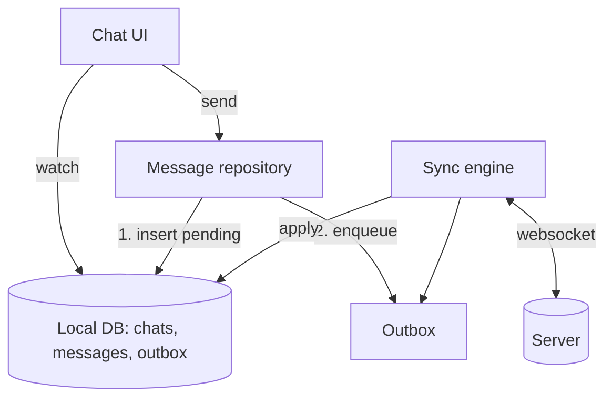

# Mobile system design

Designing a mobile system out loud — a framework, then five worked examples.

## The recommendation

**Spend the first five minutes on requirements and constraints, not on architecture.** These
interviews are lost by candidates who start drawing boxes. The interviewer is testing whether
you find the constraints that matter — offline, battery, an unreliable network, a release you
cannot recall — and design *for* them, rather than reproducing a diagram you memorised.

## The framework

**1. Clarify (5 min).** Ask until you can state the problem back.

- Who uses it, how many, on what devices and OS versions?
- Which flows must work offline? What staleness is acceptable?
- What is the read/write ratio? Is data shared between users?
- What must never be lost — a message, a payment, a draft?
- What is out of scope? Say it, so you are not judged on it.

**2. Define success (2 min).** Name the numbers you are designing to: cold start under two
seconds, 60 fps scrolling, sync within thirty seconds of reconnect, crash-free above 99.5%.
Stating a target is what lets every later decision be justified rather than asserted.

**3. Sketch the architecture (10 min).** Client layers, local storage, sync, backend contract —
at the level of responsibilities, not class names.

**4. Go deep where it is hard (15 min).** Sync and conflicts, pagination and caching, real-time
delivery, media, auth. Let the interviewer pick, or pick the hardest one yourself.

**5. Failure modes (5 min).** Offline, flaky network, app killed mid-write, expired token,
server 500, clock skew, full storage. Candidates skip this section; interviewers weight it
heavily.

**6. Scale and operate (5 min).** What breaks at 10× the data, how you observe it, how you turn
it off.

## The constraints that make mobile different

Say these out loud — they are the vocabulary of the interview.

- **The network is unreliable and sometimes absent.** Every design answers "what happens
  offline" for reads *and* writes.
- **You cannot recall a release.** A bug lives on devices until users update, so feature flags
  and server-driven config are the only fast levers.
- **The device is constrained.** Battery, memory, and a CPU an order of magnitude slower than
  your laptop. Background execution is metered by the OS.
- **The client is untrusted.** Authorisation is server-side; the client is a UI.
- **Storage is finite and can be cleared.** Design for a cold cache at any moment.
- **Clocks are wrong.** Resolve conflicts with server versions, never device timestamps.

## Worked example: chat (WhatsApp)

**Establish first:** one-to-one and group, offline send and read, delivery and read receipts,
media, history, ordering.

The decisions that carry the answer:

- **The local database is the source of truth.** The UI watches it and never waits on the
  network. Lead with this sentence.
- **Client-generated message ids (UUID).** The message exists before the server sees it, the id
  doubles as the idempotency key, and a retry cannot duplicate it. One choice that answers
  three follow-up questions.
- **Status as a state machine** — `pending → sent → delivered → read`, plus `failed` — stored
  per message and rendered as the tick marks.
- **Order by server sequence, not device time.** A monotonic per-chat sequence gives a stable
  order; local pending messages sit at the end until acknowledged.
- **WebSocket for delivery, push notification as the wake-up.** On reconnect, fetch everything
  after the last known sequence — delta sync, with tombstones for deletions.
- **Media out of band.** Upload to object storage, send a reference. Never put bytes through
  the message channel.

**Failure modes worth raising unprompted:** the app killed between the local insert and the
enqueue (one transaction, so it cannot happen), the same message delivered twice (idempotent by
id), and a message that fails permanently (park it after N attempts and surface a retry, rather
than blocking the queue behind it).

Mechanics in [offline first](../part-03-data/offline-first.md).

## Worked example: a banking app

**What is different:** correctness beats latency, security is a hard requirement, and
compliance shapes the architecture.

- **Never optimistic about money.** Transfers show a pending state until the server confirms.
  An optimistic transfer that rolls back is a support call and possibly a regulatory issue.
- **Idempotency keys on every write**, generated client-side. Say this early — it is the answer
  to "what if the network drops mid-payment".
- **Short sessions, biometric re-authentication for sensitive actions**, and step-up auth
  decided server-side. The client asks; the server decides.
- **Cache display data, never credentials.** Recent transactions cached for a fast open,
  balances labelled with their age, secrets in the Keychain or Keystore.
- **An audit trail** server-side, with device and session context on every sensitive action.
- **Pinning is genuinely on the table here** — and this is where you state its cost: two pins,
  a kill switch, rehearsed rotation, or a bricked app. See
  [network security](../part-04-production/security-network.md).

## Worked example: ride sharing (Uber)

**What is different:** continuous location, real-time matching, and battery.

- **The location strategy is most of the answer.** Adaptive sampling — high frequency during a
  ride, low when idle, geofence-triggered rather than polled in the background. Say "battery"
  before the interviewer does.
- **A persisted trip state machine**: idle → requesting → matched → en route → in progress →
  complete. Every screen is a projection of it, and it must survive a restart.
- **Server-authoritative matching.** The client displays; it never decides.
- **The map is the performance problem.** Throttle marker updates, interpolate between them
  rather than jumping, and keep the work off the widget layer.
- **Offline is degraded, not absent.** Cached tiles, a trip state that survives a tunnel, and a
  queued fare summary when the network is gone at completion.

## Worked example: offline POS

**What is different:** offline is the normal case, and money is involved.

- **Everything local first**: products, prices and tax rules cached; sales written locally and
  queued.
- **Gapless receipt numbers per device**, prefixed by device id so two terminals never collide
  — a tax audit follows that sequence, so it is never renumbered.
- **Sync is push-only for sales and pull for the catalogue**, so a price change and a sale
  cannot conflict.
- **A conflict policy per entity:** catalogue server-wins, sales client-wins and append-only,
  stock reconciled server-side rather than merged on device.
- **Hardware over channels** — printer, card reader, cash drawer — each with a failure path a
  cashier can act on. See
  [platform channels](../part-04-production/native-platform-channels.md).

## Worked example: e-commerce

**What is different:** read-heavy, cache-sensitive, conversion-critical.

- **Cursor pagination**, so an inserted product does not duplicate a row mid-scroll.
- **Stale-while-revalidate for the catalogue**, with a stated exception: prices and stock are
  network-first, because stale there misleads a customer.
- **Images**: server-side thumbnails, decode at display size, disk cache, and placeholders
  sized to the final image so the list does not reflow under the user's finger.
- **The cart is local and authoritative until checkout**, merged server-side at sign-in.
- **Checkout gets the integration test and the feature flag**, because that is where the money
  is.

## What interviewers are listening for

- **Requirements before architecture.** Drawing first is marked down.
- **Offline addressed explicitly**, for reads and writes.
- **Idempotency, unprompted.** The single strongest signal of production experience.
- **Named tradeoffs.** "Last write wins, which loses the older edit silently — fine for
  settings, not for documents."
- **Failure modes**, including app kill, clock skew, and permanent failures.
- **Knowing what you left out**, and saying so.

Negative signals: layer diagrams with no problem attached, "we'll use Firebase" as an
architecture, ignoring battery and memory, and trusting the client.

## Practice prompts

Forty-five minutes each, out loud, using the framework:

1. A banking app with offline balances and secure transfers.
2. WhatsApp: offline messaging, delivery receipts, media.
3. Uber: real-time location, matching, trip state.
4. An ERP field app: large catalogues, role permissions, offline edits, audit log.
5. An offline POS with receipts, hardware, and end-of-day reconciliation.
6. A white-label app for eight brands from one codebase.
7. Push notifications end to end, including deep links and a logged-out user.

## See also

- [Offline first](../part-03-data/offline-first.md) — the sync patterns all of these use
- [Networking](../part-03-data/networking.md) — idempotency, retries, pagination
- [Design systems](../part-05-enterprise/design-systems.md) — the white-label answer
- [Question bank](flutter-questions.md) — the deep dives that follow a design round
