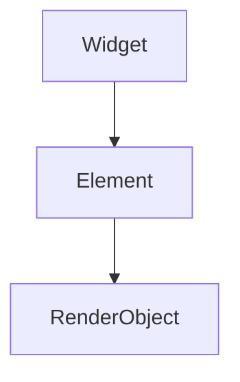

# Style Guide

The handbook has a voice. Keeping it consistent matters more than any individual
preference, so this page is the tiebreaker when two contributors disagree.

## The two rules that matter

**Lead with the recommendation, then justify it.** A reader who stops after the first
paragraph should still know what to do. Do not build up to the answer.

> **Bad:** "There are many approaches to dependency injection. Some teams use service
> locators, others prefer constructor injection…"
>
> **Good:** "Inject dependencies through constructors. Reach for a service locator only
> where a constructor cannot reach — deep in a widget tree, or across an isolate."

**Always name the tradeoff.** Every technique costs something: build time, boilerplate,
a concept the next hire must learn. A page that recommends without costing is incomplete,
and a reviewer will ask for the cost.

> "Certificate pinning stops an attacker with a trusted root from reading traffic. It
> also means a rotated certificate bricks every installed copy of the app until users
> update — plan the rotation before you ship the pin."

## Voice

- **Second person, present tense.** "You wrap the widget in…", not "One would wrap…".
- **No hype.** Skip "blazing fast", "game changer", "simply", "just". If it were simple
  the page would not exist.
- **Short sentences over clever ones.** This is reference material read by tired people.
- **Name the version.** Framework behaviour changes. "As of Flutter 3.24" ages honestly;
  "currently" does not.
- **Prefer measured numbers to adjectives.** "Cut the frame from 22 ms to 9 ms on a Pixel
  6a" beats "much faster". If you have not measured, say so.

## Structure of a page

```markdown
# Page Title

One or two sentences: what this page answers and who needs it.

## The recommendation

What to do, stated plainly, in the first paragraph.

## Why

The reasoning. Mechanism, not assertion.

## The cost

What this buys you and what it charges. Non-negotiable section.

## When not to use it

The cases where the recommendation is wrong.

## See also

Links to related pages.
```

Deviate when the topic calls for it — a cheatsheet has no prose at all — but a page that
recommends something should answer all four questions somewhere.

## Formatting

- **One sentence per line** in Markdown source where practical. It keeps diffs readable
  and reviews specific.
- **Wrap at 90 characters.** Long lines make side-by-side review painful.
- **Sentence case for headings.** "Choosing a state management approach", not "Choosing
  A State Management Approach".
- **Admonitions carry weight.** Use `!!! warning` for things that cause data loss or
  crashes, `!!! tip` for genuine shortcuts, `!!! note` for asides. Three per page is
  already too many.

## Code

Put samples in `code/<topic>/<name>.dart` and embed them:

````markdown
```dart
;--8<-- "flutter/counter_controller.dart"
```
````

(Drop the leading `;` — it is only there to stop this page from expanding the example.)

Embedded samples are formatted, analyzed, and tested by CI, so they cannot rot silently.
Inline fences are fine for two or three lines of illustration; anything longer belongs in
`code/`.

Sample code should:

- **Compile.** Run `./scripts/check.sh` before pushing.
- **Carry comments that explain why**, not what. `// Dispose here or the stream outlives
  the widget` earns its line; `// dispose the controller` does not.
- **Be complete enough to paste.** Imports included, no `...` standing in for the part
  that matters.

## Diagrams

Mermaid, fenced as `mermaid`. The theme renders it natively — no image export.

````markdown

````

Diagrams reused across pages live in `docs/diagrams/` as `.mmd` files; keep the source
and the fence in sync when you edit either.

## Links

- Relative links between pages: `[Profiling](../part-04-production/performance-profiling.md)`.
- Link to repository files (LICENSE, ROADMAP) with a full GitHub URL — the docs build
  cannot resolve paths outside `docs/`.
- Link the first mention of a concept covered elsewhere, then stop. One link per concept
  per page.

## Terminology

Use these consistently:

| Use | Not |
| --- | --- |
| widget tree, element tree, render tree | the tree |
| raster thread | GPU thread (renamed in Flutter 2.5) |
| state management approach | state management solution |
| Flutter SDK | Flutter framework, when you mean the SDK |

New terms that appear in more than one page belong in the
[glossary](appendix/glossary.md).
